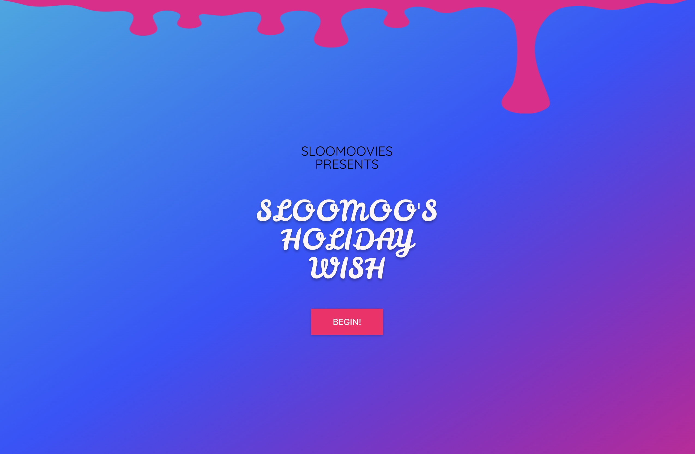
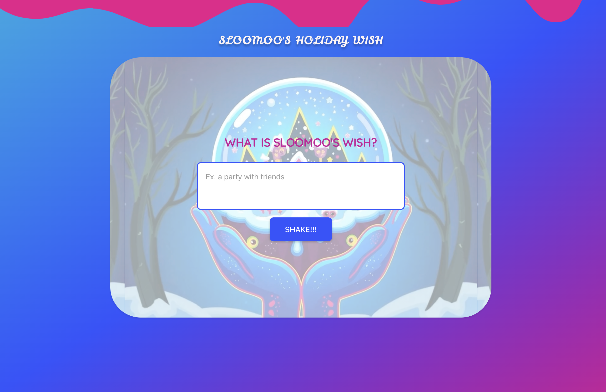
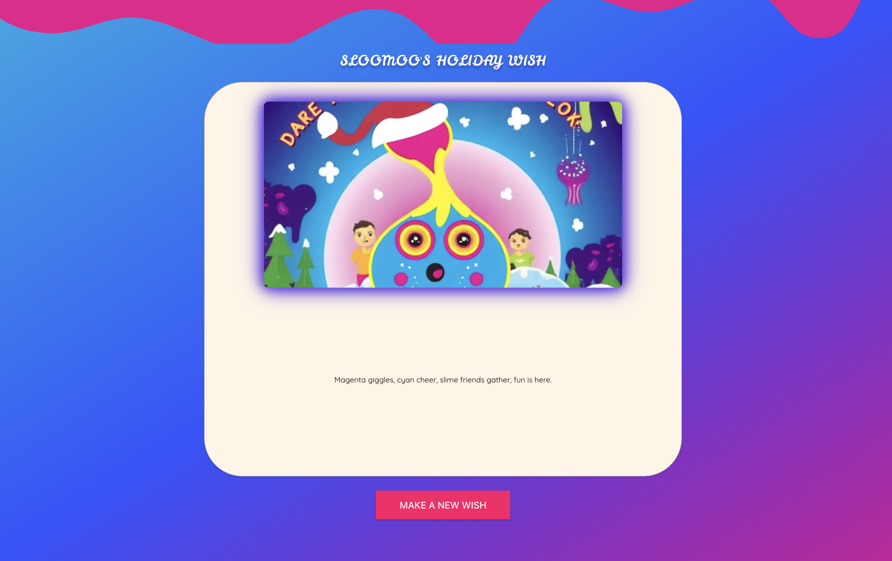

# Sloomoo: Holiday Wish Experience


**Sloomoo** is an AI-powered interactive holiday experience that blends **storytelling, poetry, and generative visuals**.  
Built for a holiday party, it invites users to **journey through a festive narrative**, make a wish, and receive a **personalized AI-generated surprise**.

---

## Live Demo

[Try Sloomoo Here](https://sloomoo.vercel.app)

---

## App Flow

| Opening Screen                         | Poetic Journey                         | Make a Wish                      | AI Output                            |
| -------------------------------------- | -------------------------------------- | -------------------------------- | ------------------------------------ |
|  |  |  |  |

---

## Project Overview

Sloomoo invites users to:

1. **Experience a Poetic Journey**  
   Navigate through whimsical poems paired with short videos.
2. **Make a Wish**  
   Share your holiday wish using an interactive form.
3. **Receive AI Surprises**
   - A **custom poem** crafted by ChatGPT
   - A **unique visual** generated by ComfyUI with a holiday LoRA model

This creates a magical, festive storytelling experience that’s both **personalized and shareable**.

---

## Features

- **Interactive Poetry Experience**: Narrative told through videos + poems
- **Make a Wish**: Users submit wishes in a playful snowglobe form
- **AI-Generated Visuals**: ComfyUI flux prompt + custom LoRA generates unique art
- **Personalized Poems**: ChatGPT tailors each poem to the user’s wish
- **Real-Time Updates**: Socket.IO streams generated results instantly
- **Responsive Design**: Works on desktop and mobile

---

## Technology Stack

**Frontend**

- React, React Router
- Bootstrap, custom CSS (holiday theme)

**Backend**

- Express + Node.js
- Socket.IO for live updates
- Python bridge for ComfyUI

**AI & Cloud**

- OpenAI GPT for poems + flux prompts
- ComfyUI for image generation
- AWS S3 for output storage

---

## Quick Start

### 1. Clone the repo

```bash
git clone https://github.com/yourusername/sloomoo.git
cd sloomoo
```

### 2. Run the client

```bash
cd client
npm install
npm start
```

### 3. Run the server

```bash
cd ../server
npm install
npm run dev
```

### 4. Visit in Browser

Open http://localhost:3000
to start your journey

## Environment Variables

### Client (client/.env)

```bash
REACT_APP_SERVER_URL=http://localhost:3001
```

### Server (server/.env)

```bash
CHATGPT_API_KEY=your_openai_api_key
FRONTEND_URL=http://localhost:3000
SERVER_URL=http://localhost:3001
AWS_REGION=your_region
AWS_ACCESS_KEY=your_access_key
AWS_SECRET_ACCESS_KEY=your_secret
```

## Credits

- Producer / UX Designer: Maddie Hong

- Full Stack Developer: Isaac Laster

- GenAI Videos: Verena Puhm

- Poem & QA: Jagger Waters

- LoRA Training: Backlot AI
  & Kenbot

- Storytellers: You!

Special thanks to: Sloomoo Institute, Machine Cinema, Pickaxe

## License

MIT © 2025 Isaac Laster
